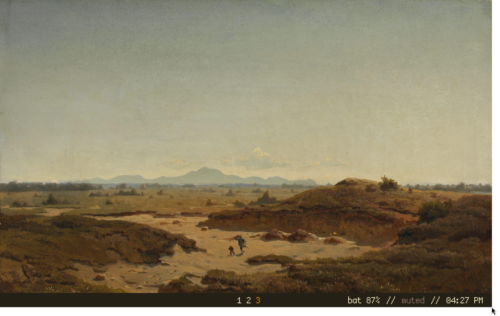

# My Personal Dotfiles

Dots for the laptop and desktop. Incomplete and always a work in progress. 

# Tech used:
- DE: i3wm
- OS: Arch linux
- Bar: Polybar
- Terminal: Alacritty
- Editor: Neovim
- Colorscheme: [Swamp](https://github.com/masroof-maindak/swamp.nvim)
- Font: [Cozette](https://github.com/slavfox/Cozette)
